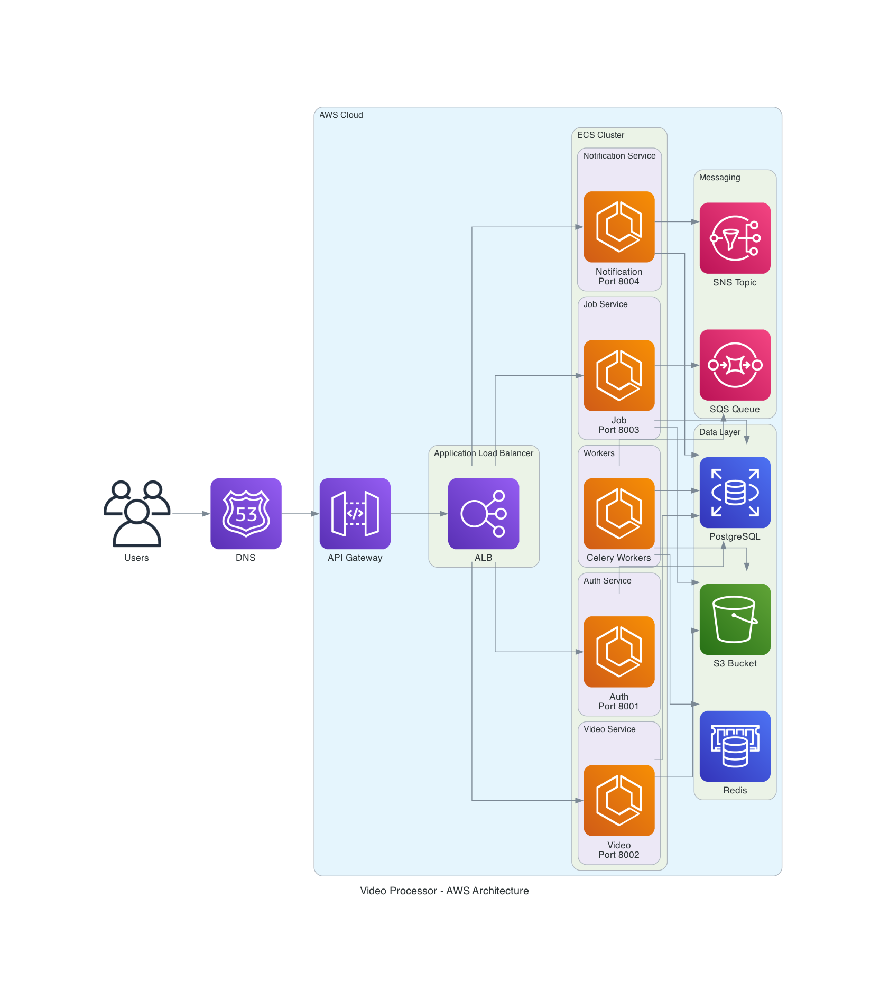
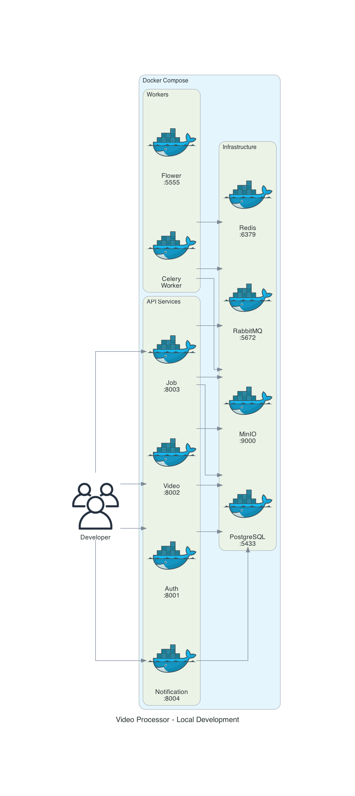

# 🎬 Video Processor - Ambiente de Desenvolvimento Local

Este repositório contém tudo para rodar localmente a arquitetura de microserviços do Video Processor (auth, upload, jobs e notificacoes), incluindo a infraestrutura simulada via LocalStack.

## 📐 Arquitetura

### AWS Production


### Local Development  


---

## 🏗️ Repositórios do Projeto

| Repositório | Descrição | Porta |
|-------------|-----------|-------|
| [fiap-soat-video-shared](https://github.com/morgadope/fiap-soat-video-shared) | Biblioteca compartilhada (Value Objects, DTOs, Events) | - |
| [fiap-soat-video-auth](https://github.com/morgadope/fiap-soat-video-auth) | Serviço de autenticação (JWT, registro, login) | 8001 |
| [fiap-soat-video-service](https://github.com/morgadope/fiap-soat-video-service) | Serviço de upload e gestão de vídeos | 8002 |
| [fiap-soat-video-jobs](https://github.com/morgadope/fiap-soat-video-jobs) | Serviço de processamento de jobs (FFmpeg) | 8003 |
| [fiap-soat-video-notifications](https://github.com/morgadope/fiap-soat-video-notifications) | Serviço de notificações por email (SES local) | 8004 |
| [fiap-soat-video-infra](https://github.com/morgadope/fiap-soat-video-infra) | Infraestrutura Terraform para AWS | - |
| [fiap-soat-video-local-dev](https://github.com/morgadope/fiap-soat-video-local-dev) | Este repositório - ambiente local | - |

---

## 🚀 Quick Start - Rodar Localmente

### Pré-requisitos

- Docker Desktop instalado e rodando
- Git
- 8GB RAM disponível (recomendado)

### 1. Clone este repositório

```bash
git clone https://github.com/morgadope/fiap-soat-video-local-dev.git
cd fiap-soat-video-local-dev
```

### 2. Configure as variáveis de ambiente

```bash
cp .env.example .env
# Edite o .env conforme necessário
```

### 3. Inicie a infraestrutura

```bash
# Subir apenas infraestrutura (PostgreSQL, Redis, LocalStack)
docker-compose -f docker-compose.infra.yml up -d

# Verificar se está saudável
docker-compose -f docker-compose.infra.yml ps
```

### 4. Inicie todos os serviços

```bash
# Subir tudo (infraestrutura + microserviços + workers)
docker-compose up -d --build

# Ver logs
docker-compose logs -f
```

### 5. Inicialize recursos AWS locais

```bash
# Windows
./init-scripts/localstack-init.ps1

# Linux/Mac
./init-scripts/localstack-init.sh
```

### 6. Acesse os serviços

| Serviço | URL | Credenciais |
|---------|-----|-------------|
| API Docs (Swagger) | http://localhost:8000/docs | - |
| Auth Service | http://localhost:8001/docs | - |
| Video Service | http://localhost:8002/docs | - |
| Job API Service | http://localhost:8003/docs | - |
| Notification Service | http://localhost:8004/docs | - |
| LocalStack | http://localhost:4566 | - |

---

## 📁 Estrutura dos Arquivos

```
fiap-soat-video-local-dev/
├── docker-compose.yml           # Orquestra TODOS os serviços + workers
├── docker-compose.infra.yml     # Apenas infraestrutura
├── .env.example                  # Variáveis de ambiente
├── init-scripts/                 # Scripts de inicialização do banco
│   ├── init-auth-db.sql         # Schema do Auth Service
│   ├── init-video-db.sql        # Schema do Video Service
│   ├── init-job-db.sql          # Schema do Job Service
│   └── init-notification-db.sql # Schema do Notification Service
├── nginx/
│   └── nginx.conf               # Configuração do load balancer
├── architecture_aws.png         # Diagrama da arquitetura AWS
├── architecture_local.png       # Diagrama da arquitetura local
└── generate_diagrams.py         # Script para gerar diagramas
```

---

## 🔧 Comandos Úteis

### Docker Compose

```bash
# Iniciar tudo
docker-compose up -d

# Parar tudo
docker-compose down

# Ver logs de um serviço específico
docker-compose logs -f job-worker
docker-compose logs -f notification-worker

# Reiniciar um serviço
docker-compose restart job-worker

# Ver status
docker-compose ps

# Limpar tudo (incluindo volumes)
docker-compose down -v
```

### Banco de Dados

```bash
# Acessar PostgreSQL do job-service
docker exec -it vp-postgres-job psql -U postgres -d job_db

# Ver tabelas
\dt

# Sair
\q
```

### Redis

```bash
# Acessar Redis CLI
docker exec -it vp-redis redis-cli

# Ver todas as chaves
KEYS *

# Sair
exit
```

---

## 🧪 Testando a API

### 1. Health Check

```bash
curl http://localhost:8000/health | python -m json.tool
```

### 2. Registrar Usuário

```bash
curl -X POST http://localhost:8000/auth/register \
  -H "Content-Type: application/json" \
  -d '{"email":"user@test.com","password":"Test1234!","full_name":"Test User"}'
```

### 3. Login

```bash
curl -X POST http://localhost:8000/auth/login \
  -H "Content-Type: application/json" \
  -d '{"email":"user@test.com","password":"Test1234!"}'
```

### 4. Upload de vídeo (com token)

```bash
TOKEN="seu_token_aqui"
curl -X POST http://localhost:8000/videos/upload \
   -H "Authorization: Bearer $TOKEN" \
   -F "file=@meu_video.mp4"
```

### 5. Listar Vídeos (com token)

```bash
TOKEN="seu_token_aqui"
curl http://localhost:8000/videos \
  -H "Authorization: Bearer $TOKEN"
```

---

## 🔧 LocalStack - Simulando AWS Localmente

O LocalStack simula os serviços AWS localmente. Já está configurado no `docker-compose.infra.yml`.

### Serviços Disponíveis

| Serviço AWS | Porta Local | Uso |
|-------------|-------------|-----|
| S3 | 4566 | Armazenamento de vídeos e frames |
| SQS | 4566 | Fila de processamento de jobs |
| SNS | 4566 | Notificações de eventos |
| SES | 4566 | Envio de emails |

### Configuração

Configure as variáveis de ambiente para usar LocalStack:

```bash
export AWS_ENDPOINT_URL=http://localhost:4566
export AWS_ACCESS_KEY_ID=test
export AWS_SECRET_ACCESS_KEY=test
export AWS_REGION=us-east-1
```

### Recursos Criados Automaticamente

O script `init-scripts/localstack-init.sh` cria:

- **S3 Buckets**: `video-uploads`, `video-outputs`
- **SQS Queues**: `job-queue`, `notification-queue` (com DLQs)
- **SNS Topics**: `video-events`, `job-events`
- **SES**: Email verificado `noreply@videoprocessor.local`

### Usando AWS CLI com LocalStack

```bash
# Listar buckets
aws --endpoint-url=http://localhost:4566 s3 ls

# Ver filas SQS
aws --endpoint-url=http://localhost:4566 sqs list-queues

# Ver tópicos SNS
aws --endpoint-url=http://localhost:4566 sns list-topics
```

## 🔄 Fluxo de Funcionamento

1. Usuario registra e faz login no Auth Service (JWT).
2. Upload no Video Service grava metadados e publica evento `video-events`.
3. Job Worker consome o evento, cria o job e processa o video (FFmpeg, 1 fps).
4. Frames sao zipados e enviados ao bucket de output.
5. Job Worker publica evento `job-events`.
6. Notification Worker consome o evento e registra notificacao no banco.

## 📥 Download do ZIP

O Job API retorna `download_url` com link pronto (presigned) no endpoint `/jobs`.

## 📦 Usando a Shared Library

```python
from video_processor_shared.aws import get_s3_client
from video_processor_shared.aws.s3_storage import S3StorageService
from video_processor_shared.aws.sqs_service import SQSService

# Cria clientes que automaticamente usam LocalStack se AWS_ENDPOINT_URL estiver setada
s3 = S3StorageService()
sqs = SQSService()

# Upload de vídeo
await s3.upload_video(file, "video.mp4", "user-123")

# Enviar mensagem para fila
await sqs.send_message({"job_id": "123", "video_key": "videos/user-123/..."})
```

---

## 🐛 Troubleshooting

### Erro: "Cannot connect to Docker daemon"
```bash
# Verifique se Docker Desktop está rodando
open -a Docker
```

### Erro: "Port already in use"
```bash
# Encontrar processo na porta
lsof -i :8000
# Matar processo
kill -9 <PID>
```

### Containers não iniciam
```bash
# Ver logs detalhados
docker-compose logs --tail=100

# Reconstruir imagens
docker-compose build --no-cache
docker-compose up -d
```

### Banco de dados vazio
```bash
# Recriar volumes
docker-compose down -v
docker-compose up -d
```

---

## 📊 Monitoramento

### Prometheus Queries

- **Requisições por segundo**: `rate(http_requests_total[5m])`
- **Latência P95**: `histogram_quantile(0.95, rate(http_request_duration_seconds_bucket[5m]))`
- **Jobs na fila**: `rabbitmq_queue_messages{queue="video_processing"}`

### Grafana Dashboards

Acesse http://localhost:3000 e importe os dashboards:
- API Performance
- Worker Metrics
- Infrastructure Health

---

## 🔄 Fluxo de Processamento

```
1. Usuário faz upload do vídeo
   └─> POST /videos/upload

2. Video Service salva metadados no PostgreSQL
   └─> Faz upload do arquivo para MinIO
   └─> Publica evento no RabbitMQ

3. Celery Worker consome a mensagem
   └─> Baixa vídeo do MinIO
   └─> Extrai frames com FFmpeg
   └─> Cria ZIP com frames
   └─> Upload do ZIP para MinIO
   └─> Atualiza status do job para COMPLETED

4. Notification Service envia email
   └─> Usuário recebe link para download
```

---

## 📝 Licença

MIT License - veja [LICENSE](LICENSE) para detalhes.
