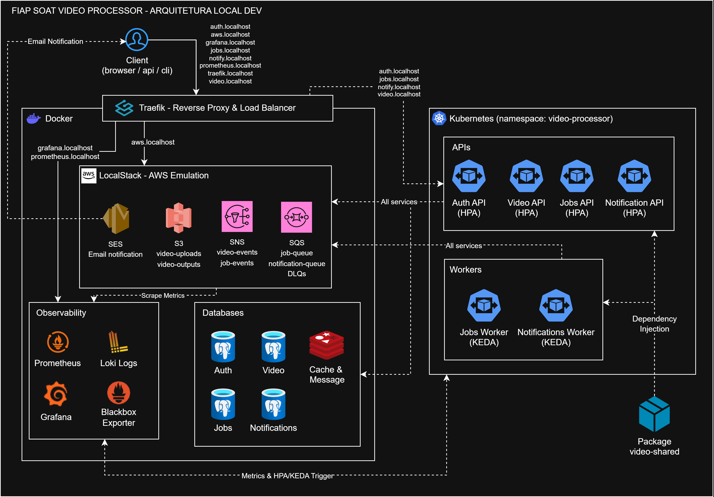

# FIAP SOAT Video Processor

## Introdução
Este é o repositório principal do ecossistema **FIAP SOAT Video Processor**, um projeto educacional desenvolvido para o curso de Pós-Graduação em Software Architecture da **FIAP**.

O sistema realiza a **extração automática de frames de vídeos**: ao receber um vídeo, o processador extrai um frame por segundo e devolve ao usuário um arquivo `.zip` contendo todos os frames gerados. O processamento é assíncrono, orientado a eventos e escalável, utilizando filas de mensagens (SQS/SNS), autoscaling baseado em carga (KEDA) e notificações por e-mail ao término de cada job.

Este repositório orquestra a infraestrutura local, o roteamento, a observabilidade e o deploy dos microserviços para desenvolvimento integrado.

## Sumário
- Explicação do projeto
- Objetivo
- Diagrama de arquitetura
- Como funciona
- Repositórios relacionados
- Integrações com outros repositórios
- Como executar
- Como testar

## Repositórios relacionados
- [fiap-soat-video-auth](https://github.com/SOAT-264/fiap-soat-video-auth)
- [fiap-soat-video-service](https://github.com/SOAT-264/fiap-soat-video-service)
- [fiap-soat-video-jobs](https://github.com/SOAT-264/fiap-soat-video-jobs)
- [fiap-soat-video-notifications](https://github.com/SOAT-264/fiap-soat-video-notifications)
- [fiap-soat-video-shared](https://github.com/SOAT-264/fiap-soat-video-shared)
- [fiap-soat-video-obs](https://github.com/SOAT-264/fiap-soat-video-obs)

## Explicação do projeto
O **FIAP SOAT Video Processor** é uma aplicação distribuída de extração de frames de vídeo, construída como projeto educacional para a FIAP. O fluxo central consiste em:

1. O usuário faz upload de um vídeo via API.
2. O sistema extrai **1 frame por segundo** do vídeo enviado.
3. Todos os frames são compactados em um arquivo `.zip` e armazenados no S3.
4. O usuário recebe uma **notificação por e-mail** com o link para download do resultado.

O projeto explora conceitos avançados de arquitetura de software:
- **Mensageria e eventos**: comunicação entre serviços via SNS (pub/sub) e SQS (filas de trabalho), garantindo desacoplamento e resiliência.
- **Autoscaling**: workers de processamento e notificação escalam automaticamente com base no número de mensagens na fila, utilizando KEDA (Kubernetes Event-Driven Autoscaling).
- **Microserviços**: responsabilidades separadas em serviços independentes (auth, video, jobs, notifications).
- **Observabilidade**: métricas, health checks e dashboards unificados via Prometheus, Grafana e Loki.
- **Segurança**: autenticação centralizada com JWT, isolamento por namespace Kubernetes e segredos gerenciados via Kubernetes Secrets.
- **Linguagem e arquitetura**: todos os microserviços são implementados em **Python**, seguindo os princípios da **arquitetura hexagonal** (Ports & Adapters), mantendo o domínio isolado de frameworks e infraestrutura.

Este repositório centraliza o ambiente de desenvolvimento local com:
- `docker-compose.yml` para infraestrutura base, gateway (Traefik) e stack de observabilidade.
- Scripts one-shot de inicialização e encerramento em `scripts/windows/start.ps1` e `scripts/windows/down.ps1`.
- Scripts organizados por plataforma em `scripts/windows` e `scripts/linux`, com SQL em `scripts/sql`.
- Scripts de bootstrap do LocalStack para S3, SNS, SQS e SES em `scripts/windows/localstack-init.ps1` e `scripts/linux/localstack-init.sh`.
- Rotas dinâmicas do Traefik para expor os serviços Kubernetes em domínios locais (`*.localhost`).

## Objetivo
Padronizar e simplificar o processo de subir, integrar e validar todos os serviços do sistema em um único fluxo de desenvolvimento local.

## Diagrama de arquitetura


## Como funciona
1. O `docker compose up -d` sobe a infraestrutura local:
PostgreSQLs por domínio, Redis, LocalStack, Traefik e observabilidade (Prometheus/Grafana/Loki/Blackbox).
2. O script `scripts/windows/localstack-init.ps1` cria e conecta recursos AWS simulados:
S3 (`video-uploads`, `video-outputs`), SNS (`video-events`, `job-events`) e SQS (`job-queue`, `notification-queue`).
3. O script one-shot `scripts/windows/start.ps1` faz build das imagens locais dos serviços e aplica os overlays Kubernetes `local-dev` dos repositórios:
auth, jobs (api + worker), notifications (api + worker) e video-service.
4. O Traefik roteia os hosts locais para NodePorts Kubernetes:
`auth.localhost`, `jobs.localhost`, `notify.localhost`, `video.localhost`.
5. O pipeline assíncrono principal fica:
`video uploaded -> video-events (SNS) -> job-queue (SQS) -> jobs worker -> job-events (SNS) -> notification-queue (SQS) -> notifications worker`.

## Integrações com outros repositórios
| Repositório integrado | Como integra | Para que serve |
| --- | --- | --- |
| `fiap-soat-video-auth` | Build da imagem local e deploy via `kubectl apply -k .../k8s/overlays/local-dev` | Disponibilizar autenticação/identidade para os demais serviços |
| `fiap-soat-video-service` | Build e deploy, roteamento `video.localhost` e dependência de LocalStack para storage/eventos | Receber uploads de vídeo e disparar eventos de processamento |
| `fiap-soat-video-jobs` | Build e deploy da API e worker SQS/KEDA | Processar vídeos assincronamente e publicar eventos de status |
| `fiap-soat-video-notifications` | Build e deploy da API e worker SQS/KEDA | Consumir eventos de job e enviar notificações por e-mail |
| `fiap-soat-video-shared` | Copiado e instalado nos Dockerfiles dos serviços | Compartilhar contratos, eventos e value objects entre microserviços |
| `fiap-soat-video-obs` | Incluído no `docker-compose.yml` principal via `include` | Coletar métricas, health checks e dashboards do ambiente |

## Como executar
### Pré-requisitos
- Docker Desktop com Kubernetes habilitado.
- `kubectl` configurado para o cluster local.
- KEDA instalado no cluster local (necessário para o HPA/autoscaling de workers).
- Metrics Server instalado no cluster local (necessário para o HPA baseado em CPU/memória).
- PowerShell 5.1+.

### Scripts one-shot
- Recomenda-se o uso dos scripts one-shot para subir e derrubar o ambiente completo.
- O fluxo principal atual está em `scripts/windows/start.ps1` e `scripts/windows/down.ps1`.
- Também é possível usar a versão Linux via `scripts/linux/start.sh` e `scripts/linux/down.sh`.

### Execução recomendada (ambiente completo)
```powershell
cd /fiap-soat-video-local-dev
Copy-Item .env.example .env -ErrorAction SilentlyContinue
.\scripts\windows\start.ps1
```

### Execução alternativa

Subir o compose principal com serviços de app em containers (perfil opcional):
```powershell
cd /fiap-soat-video-local-dev
docker compose --profile compose-apps up -d
.\scripts\windows\localstack-init.ps1
```

### Encerrar ambiente
```powershell
cd /fiap-soat-video-local-dev
.\scripts\windows\down.ps1
```

Com limpeza total de volumes:
```powershell
cd /fiap-soat-video-local-dev
.\scripts\windows\down.ps1 -PurgeData
```

## Como testar
Este repositório não possui suíte automatizada de testes. A validação é feita por smoke tests de ambiente.

1. Validar pods e serviços Kubernetes:
```powershell
kubectl get pods -n video-processor
kubectl get svc -n video-processor
```

2. Validar health checks expostos pelo gateway:
```powershell
curl http://auth.localhost/health
curl http://video.localhost/health
curl http://jobs.localhost/health
curl http://notify.localhost/health
```

3. Validar observabilidade:
- Grafana: `http://grafana.localhost`
- Prometheus: `http://prometheus.localhost`
- Traefik Dashboard: `http://traefik.localhost`


## Membros do projeto

- Diego de Salles — RM362702
- Lucas Felinto — RM363094
- Maickel Alves — RM361616
- Pedro Morgado — RM364209
- Wesley Alves — RM364342
